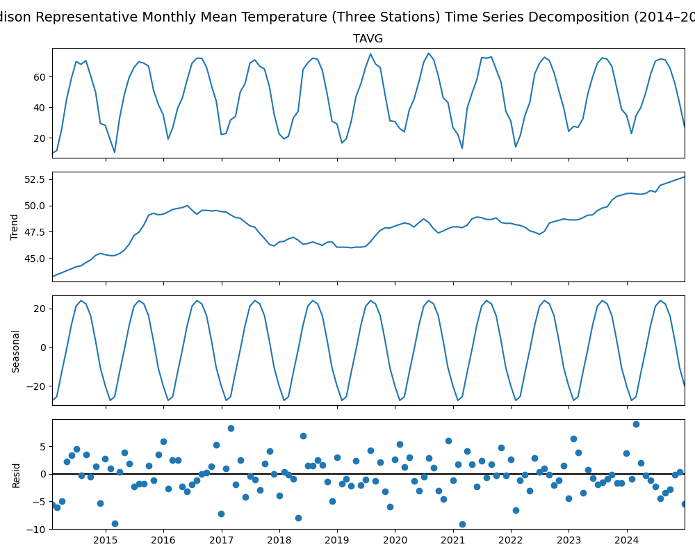

# Introduction  
Madison, Wisconsin, experiences dramatic seasonal swings in both temperature and precipitation. Winters are often below freezing, and summers can be both hot and humid. Although the city lies at a latitude similar to my hometown and is equally far inland, the local climate here feels markedly different.  

# Motivation  
I moved to Madison one year ago and was struck by how much colder its winters felt and how much wetter its summers were compared to home. Curious to quantify these impressions, I gathered monthly data for average temperature (TAVG) and total precipitation (PRCP) from 2014 through 2024. By decomposing each series into trend, seasonal, and residual components, I aimed to uncover the underlying patterns that define Madison’s climate.  

# Data and Methods  
Monthly observations were obtained from four NOAA GHCN stations in the Madison area: USC00470273, USC00471416, USW00014837, and US1WIDA0013. All four stations provided precipitation data, while three stations (the first three) supplied temperature data. After filtering out any data beyond 2024, I averaged the four stations’ monthly precipitation totals to form a single representative precipitation series, and I averaged the three stations’ monthly mean temperatures to form a single representative temperature series. I then applied an additive seasonal decomposition with a 12-month period using Python’s `statsmodels.tsa.seasonal.seasonal_decompose` function to extract long-term trends, repeating annual cycles, and irregular residuals.

# Results  
The first figure shows the decomposition of the representative temperature series into observed values, trend, seasonal cycle, and residuals:

The second figure presents the decomposition of the representative precipitation series:

# Discussion  
The temperature decomposition makes two things clear. First, a modest warming trend raises average monthly temperatures from roughly 43 °F in 2014 to about 52 °F in 2024. Second, the seasonal cycle spans more than 40 °F between winter lows and summer highs, underscoring the city’s cold winters and hot summers.  
The precipitation decomposition shows a slight wetting trend over the decade. Summer months (June–August) consistently record the highest rainfall, while spring months (March–May) are somewhat drier, and winter still contributes measurable precipitation largely as snow.  
These characteristics—deep cold in winter, hot summers, and year-round precipitation—meet the criteria for a **humid continental climate with hot summers and no dry season (Köppen Dfa)**.

# Conclusion  
By applying seasonal decomposition to station-averaged temperature and precipitation data, I have quantified the warming trend, the pronounced annual swings, and the distribution of rainfall that together define Madison’s climate. The results confirm that Madison falls squarely within the Köppen Dfa classification. Despite modest warming and wetting trends, the city’s classic four-season pattern remains robust and explains why its climate feels so distinct from other inland cities at the same latitude.

# References  

1. Peel, M. C., Finlayson, B. L., and McMahon, T. A., “Updated world map of the Köppen–Geiger climate classification,” _Hydrology and Earth System Sciences_, vol. 11, pp. 1633–1644, 2007.  

**My project code is hosted at GitHub**：  
[howardsong-uw/Climate-Data-Project](https://github.com/howardsong-uw/Climate_Data_Project_Howard)